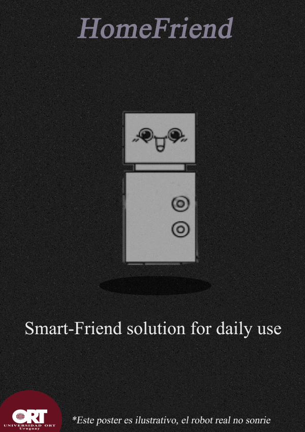
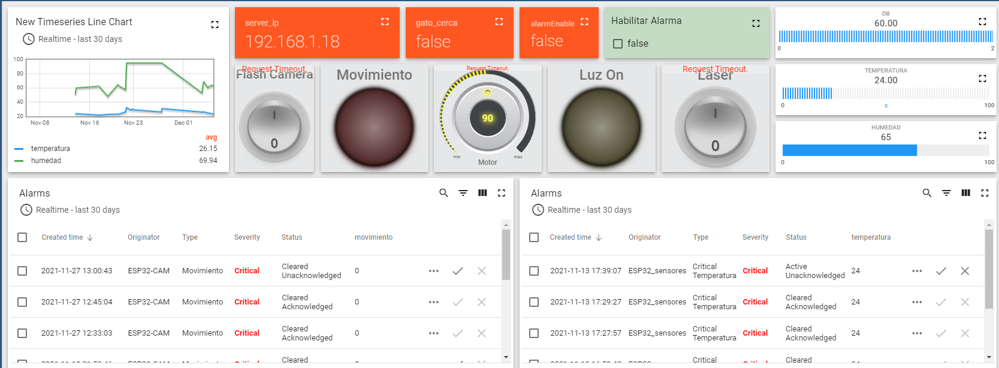
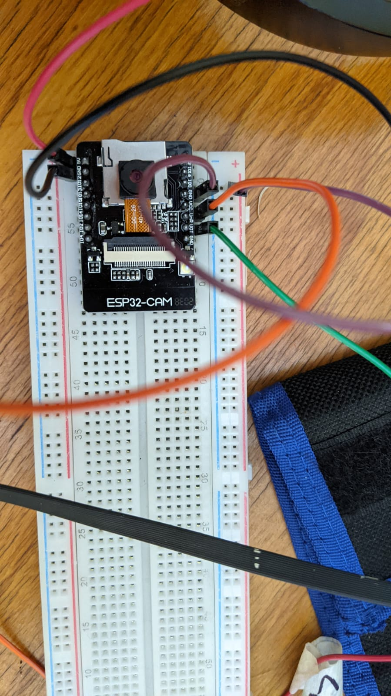

## HOME FRIEND
**Más que un robot, un amigo del hogar!.**

  
### VIDEO

<video width="1080" height="720" controls="controls">
<source src="ROBOT_20211205_BAJA.mp4" type="video/mp4">
</video>
                                                       
Video en HD: https://www.youtube.com/watch?v=mrWStz2AeSQ
                                                       
### Creadores

Ignacio Lanzani

Gabriel Rodriguez

Luis Porras

### DESCRIPCION

Quienes tienen mascotas en el hogar saben que pueden demandar mucha atención, desde un perro muy inquieto o un gato cuyo entretenimiento no basta con una simple pelota de papel. HomeFriend nace con la idea de ser una solución para estas aborrecidas mascotas, pero rápidamente pudimos apreciar el potencial de esta idea a expandirse a otras áreas cómo la vigilancia del hogar e incluso la detección de un peligro inminente (por ej.: un incendio o la presencia de gases tóxicos). Así, la intención es crear una solución más genérica y robusta a los problemas inherentes que se generan al abandonar una vivienda.

### Funcionalidades del sistema.

1. Conexión e interacción de funcionalidades con things board permite: 

- Ver temperatura actual e historico.
- Ver Humedad
- Ver Decibeles
- Ver Niveles de dióxido de carbono
- Aviso de movimiento
- Aviso de luz encendida
- Encendido de alarmas
- Histórico de alarmas
- Control de luz, láser, giro del sistema y encendido del juguete.
- Direccion Ip de los dispositivos conectados
- Recibir Emails cuando se activan las alarmas.
- Bandera si el gasto está cerca.
- El juguete se enciende automáticamente si detecta el sonido del gato.
- Streaming de video
2. El juguete se enciende automáticamente si detecta el sonido del gato.
3. Streaming de video

### Apariencia 

 Apariencia final

  
  
### Bitácora
  
  1. 19/8/2021; Duración 3hs
     - Búsqueda de información sobre ThingsBoard y ESP8266/ESP32
  
  2. 23/8/2021; Duración 3hs
     - Inicio de armado de presupuesto 
  
  3. 24/8/2021; Duración 4hs
     - Armado de placa con ESP32-Cam y Prueba de Concepto
  
  4. 6/9/2021; Duración 3hs
     - Primer impresión de uso ESP32 con thingsBoard, resultados no muy positivos
  
  5. 7/9/2021 y 9/9/2021 Duración 6Hs
     - Anteproyecto
   
  6. 11/9/2021 Duración 4hs
     - Primera implementación de motion detection, surgen problemas con los imports.

  7. 25/9/2021 Duración 6hs
     - Continuamos trabajando con el motion detection y el streaming con el server de la placa. Continúa el proceso de entendimiento de librerías.

  8. 30/9/2021 Duración 3hs
     - Recibimos los materiales para dar inicio al prototipado.
     - Conectamos la ESP32 a ThingsBoard y logramos encender un LED de manera remota. Observamos que al tener distintos switches definidos en la plataforma, los mensajes recibidos se superponen, debemos encontrar la forma de distinguirlos.

  9. 4/10/2021 Duración 3hs
     - Implementación de JSON para distinguir los mensajes recibidos por los actuadores de ThingsBoard. Incluimos un sensor ultrasonido y logramos ver la gráfica de distancia en función del tiempo en ThingsBoard.

  10. 11/10/2021 Duración 3hs
      - Hoy avanzamos poco. Se actualizó el código por una nueva versión vista en clase.
      - Empezamos a diferenciar qué elemento se activó por el nombre del método.

  11. 18/10/2021 Duración 2hs
      - Logramos enviar mails desde la placa ESP32.

  12. 21/10/2021 Duración 3hs
      - El día de hoy logramos enviar un mail desde ThingsBoard, utilizando la Rule Chain. Fue necesario ingresar el código de aplicación de Google.

  13. 23/10/2021 Duración 3hs
      - Este día empezamos a acomodar el código en distintos archivos. Creamos varias bibliotecas dedicadas a cada funcionalidad del código.
      - Logramos vincular nuestro Servo Motor con ThingsBoard y lo controlamos mediante una perilla. Comprobamos que necesitamos una fuente externa para poder alimentarlo.

  14. 25/10/2021 2hs
      - Configuramos un atributo en nuestro “device” en ThingsBoard que habilita el envío de mail (activar la alarma). Aún no logramos vincular el switch en nuestro dashboard con ese atributo.
      - Actualmente al mover el switch enviamos un mensaje a nuestra ESP32, luego de identificar el tipo de mensaje tratamos de publicar el nuevo estado del atributo. Corroboramos que el mensaje es enviado, pero ThingsBoard aún no lo entiende.

  15. 27/10/2021 Duración 1hs
      - Unificación de código. El código unificado se sube a un repo y a partir de ahí el código se trabaja exclusivamente utilizando git.

  16. 1/11/2021 Duración 3hs
      - Creación de widgets para temperatura, sonido , humedad y motion sensor. Además del láser.
Empezamos a trabajar con aislar la frecuencia del maullido del gato.
      - Implementamos arduinoFFT, se logra detectar la frecuencia fundamental y la amplitud de la señal del micrófono.
      
  17. 4/11/2021 Duración 2hs
      - La implementación funciona ahora utilizando 2 cores. Se crea un backlog con responsables para ciertas tareas.

  18. 6/11/2021 Duración 3hs
      - Utilizamos un nuevo método dentro del Thingsboard para crear alarmas sobre los distintos sensores y mandar mail, siempre que el sensor este activo la alarma manda mails, también descubrimos que el pin 2 por más que no esté siendo utilizado por la cámara cuando nosotros lo queremos usar genera conflicto, por lo cual tomamos la decisión de no usarlo lo cual nos limita demasiado la cantidad de pines disponibles. Posible solución implementación de multiplexor.

  19. 8/11/2021 Duración 3hs
      - Tratamos de implementar el uso de un servo SG90 junto a nuestro sistema. Tanto el motor cómo la cámara de nuestra ESP32 utilizan PWM para operar. Esto genera conflicto en nuestro dispositivo y cada vez que se recibe un mensaje para actualizar la posición del servo, el sistema se reinicia por completo.

  20. 9/11/2021 Duración 3hs
      - Seguimos trabajando en el servomotor, pudimos resolver el problema del reinicio de la placa asignándole un canal de PWM distinto de los canales 0 y 1 (reservados para la cámara). Actualmente nuestro Servo está trabajando en el canal 2 de PWM.
      - El día de hoy nuestra cuenta de demo.thingsboard fue desactivada. Tenemos respaldos de nuestro DashBoard y de nuestras Rule Chain para poder crear otra cuenta.

  21. 13/11/2021 Duración 10hs
      - Hoy fue un día productivo. Agregamos a nuestro proyecto una ESP 32 Dev Kit 1 para todos los sensores, dejando en la ESP32 CAM el stream y el movimiento. Luego de varios intentos de usar la ESP32 CAM y el servo, optamos también por mandarlo a la Devkit ya que nos estaba ocasionando problemas físicos a la hora de hacer un request para setear grados. En el dashboard pudimos tomar los datos de ambas placas y probamos otra variante en las alarmas para que solo manden un mail y te obligue a abrir el dashboard y dar un acknowledge o simplemente apagar la alarma. Otro tema positivo es que el servo soporta la cámara arriba. Nuevos problemas:
        - enviar por telemetría una dirección ip en formato String
        - Sigue faltando un primer prototipo.

  22. 20/11/2021 Duración 12hs
      - Avanzamos con el primer prototipo y debbugeamos problemas relacionados al consumo eléctrico del proyecto.
Optamos por disminuir nuestra idea inicial de trabajar con madera y pasamos a buscar alguna estructura que pudiéramos re utilizar con menor trabajo manual de nuestra parte.

  23. 25/11/2021 Duración 12hs
      - Avanzamos, el prototipo toma forma, compramos otro motor para mejorar el grio. Tomamos el sistema y lo dejamos pronto para llevar a la clase.

  24. 27/11/2021 Duración 14hs
      - Avanzamos con el primer prototipo y debbugeamos problemas relacionados al consumo eléctrico del proyecto (de manera provisoria).
      - Optamos por disminuir nuestra idea inicial de trabajar con madera y pasamos a buscar alguna estructura que pudiéramos re utilizar con menor trabajo manual de nuestra parte.
      - Modificamos alarmas.

  25. 1/12/2021 Duración 5hs
      - Creación y puesta en marcha de solución definitiva para problemas eléctricos.

  26. 3/12/2021 Duración 2hs
      - Testeo de nuevo agregado al hardware principal en donde aparece el motor del juguete para gato, además el DHT22 y el micrófono. Todo esto se conecta mediante cables al hardware principal. 

  27. 4/12/2021 Duración 8hs
      - Implementación página web, filmación de video (parte 1) y póster. Además se trabaja con informe final.

  28. 5/12/2021 Duración 8hs
      - Filmación de video (parte 2), se continúa informe final.

  29. 6/12/2021 Duración 8hs
      - Finalización de informe final.

  
### Jekyll Themes

Your Pages site will use the layout and styles from the Jekyll theme you have selected in your [repository settings](https://github.com/im-homefriend/HomeFriend/settings/pages). The name of this theme is saved in the Jekyll `_config.yml` configuration file.

### Support or Contact

Having trouble with Pages? Check out our [documentation](https://docs.github.com/categories/github-pages-basics/) or [contact support](https://support.github.com/contact) and we’ll help you sort it out.
  
For more details see [Basic writing and formatting syntax](https://docs.github.com/en/github/writing-on-github/getting-started-with-writing-and-formatting-on-github/basic-writing-and-formatting-syntax).
  
